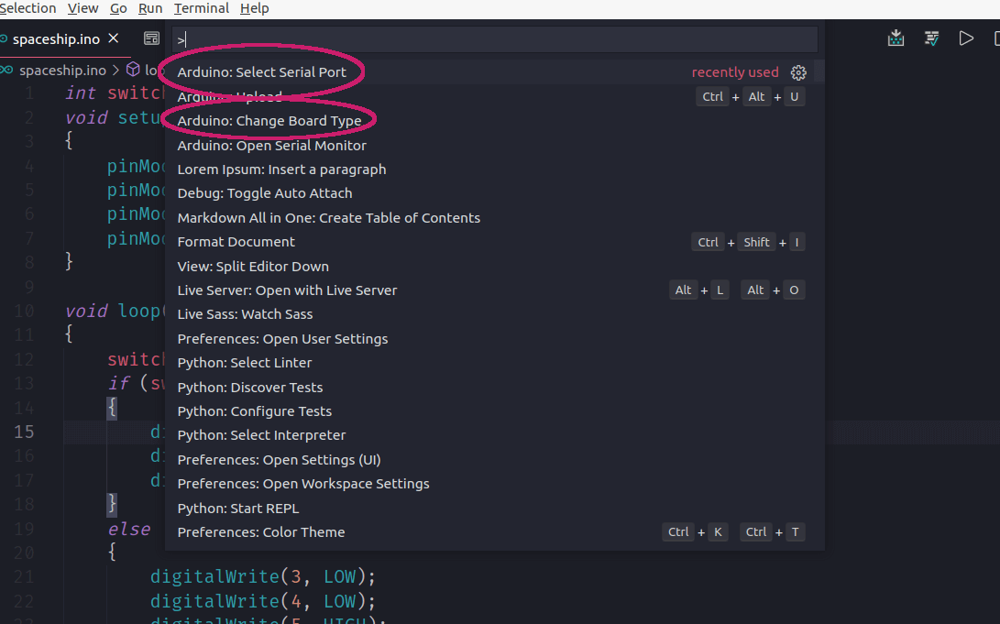
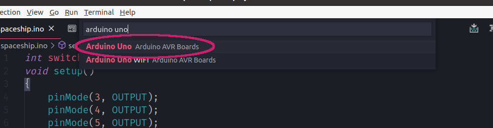
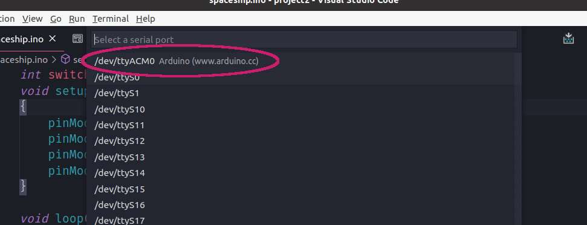
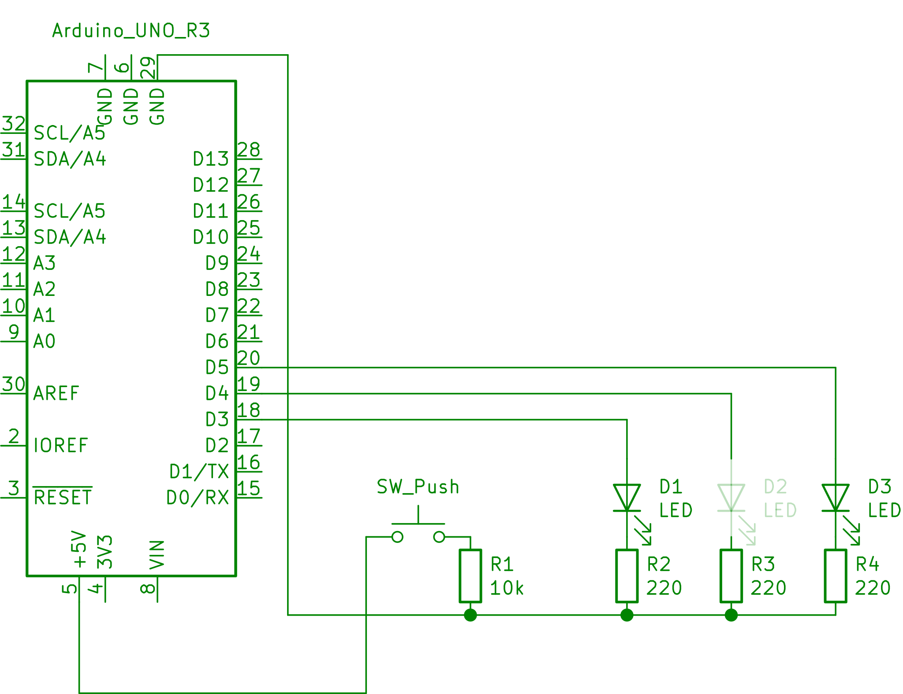
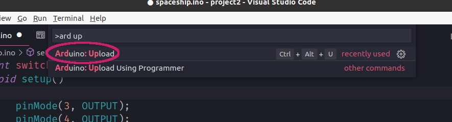

# Hello Arduino!

Felt I needed to get a break and do something different from what I usually do. Got me self an arduino uno r3. This is a hello world level project described in the project book came with the arduino kit.
It's here mostly because it goes through setup of the Arduino and coding environment as such.

## Equipment and software.

Following hardware and software was used for this project.

- An arduino uno R3
- Two red LEDs and one green
- Three 220 Ohm resistors
- One 10K ohm resistor
- a switch (push button)

- The Arduino software IDE [See Arduino guide](https://www.arduino.cc/en/Guide/Linux).
- VScode code editor [See Visualstudio code pages](https://code.visualstudio.com/).
  

## Getting up and running.
Following setup was doing in an Ubuntu environment currently is what I'm using for an OS. 

### Getting the software
The necessary software to interact with your arduino can be downloaded from [Arduino software pages](https://www.arduino.cc/en/software).
You could potentially install software using debian apt (advanced package tool) but it's not advisable as the repository at time of writing contains an pretty outdated version of the software. The software is compressed so you need to extract it to a convenient location of your choice. To install the software you just need to locate the install.sh script inside the subfolder arduino-x.x.xx where the x:s are replaced by version numbers. At time of writing that would be in the subfolder named arduino-1.8.13. To run the script from within the subfolder just run
```sh
./install.sh
```
### I prefer to use VScode 
The software comes packaged with and IDE but i'm really into VSCode at the moment. I like to do as much of my coding from within the VSCode editor. It turns out VSCode has an extension for working with Arduinos. It's made by Microsoft team and you easily find it using your extensions manager from with VSCode. Just search for Arduino. It should be among the first if not the first item in the list of extensions. 

### Connecting the board and start communicating.
I simply connected the board to my computer using the USB cable that came with the board.
To be able to communicate with the board you need to select the board model and through which port your device is connected to. These settings can be found through you command palette by pressing `Ctrl-Shift-P` and start typing ardui



Choosing select board will present you with a number of boards supported from within vscode. I started arduino un and choose the first option which worked for me. 


Next we need to select port to which your device is connected after clicking select serial port (see first screenshot) an list of available port was listed, the first choice in this list worked for me.  


I needed to do one more thing in order to get everything working and is mentioned on official pages as well but i'll come back to that.

## Circuitry
Following simple circuit was (taken from arduino project book) was used for this simple project. 


The kit came with all the components.
Technical specs are available at [https://store.arduino.cc/arduino-uno-rev3)](https://store.arduino.cc/arduino-uno-rev3). To get a quick overview I recommend the FAQ on this page. It seems digital pins operate at 5V. Data sheets for components in the kit could be found on the Arduino pages [here]( https://store.arduino.cc/genuino-starter-kit). The red led for instance has I<sub>FM</sub> (Max forward current) of 30mA. Using a resistor of 220 Ohm would put current running through the LED at around 23mA (by Ohms law V=I*R).


## The code
The main point of this document is not about code. But about how to get the system up and running. But for the next step we need a bit of code so  ill just present the snippet i used. This snippet was taken from Arduino project book.
```cpp
int switchState = 0;
void setup()
{
    pinMode(3, OUTPUT);
    pinMode(4, OUTPUT);
    pinMode(5, OUTPUT);
    pinMode(2, INPUT);
}

void loop()
{
    switchState = digitalRead(2);
    if (switchState == LOW)
    {
        digitalWrite(3, HIGH);
        digitalWrite(4, LOW);
        digitalWrite(5, LOW);
    }
    else
    {
        digitalWrite(3, LOW);
        digitalWrite(4, LOW);
        digitalWrite(5, HIGH);
        delay(250);
        digitalWrite(4, HIGH);
        digitalWrite(5, LOW);
        delay(250);
    }
}
```
Documentation on The Arduino programming language can be found at [https://www.arduino.cc/reference/en/](https://www.arduino.cc/reference/en/) pages has 
### Uploading code to board  
Uploading code to the board was a simple matter of accessing upload command from command palette like so 

Or so i though because this caused an error in the lines of not Error opening serial port... 
This is due to your user not having access writes to port. This can be rectified by adding your user to the dialout group. Almost everything in linux is in some form or another files. We can take a peek at the file representing the port we can't access like so 
```sh
ls -l /dev/ttyACM*
```
Amongst the things you will see the group owner in one of the columns which in this case is dialout. We want to be members of that group so we need to add our selves to it like so 
```sh
sudo usermod -a -G dialout $USER
``` 
The `$USER` is variable the holds the name of current user. After rebooting uploading code worked for me.


