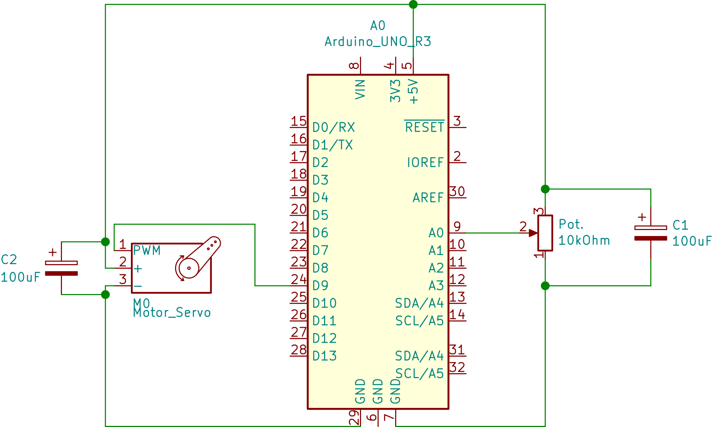

# A First servo project
The aim of this project is simply to move servos arm into specific position using the arduino and a potentiometer.

## Equipment
- Potentiometer 10KOhm
- Servo motor
- Two 100uF capacitors

## Datasheets
[Pontentiometer](https://www.arduino.cc/documents/datasheets/Potentiometer.PDF).

[Servo motor](http://descargas.cetronic.es/microservo.pdf).

## Circuity

.

The servo has a pin for controlling the position of the arm. 
The two capacitors in parallel with the two other components are decoupling capacitors. The servo will draw more power when it start moving. The capacitors will compensate for the voltage dip that will occur at this stage. 

## The code
Mapping input (0-1023) to output(0-179 degrees) values (PWM).
Servo lib available.
