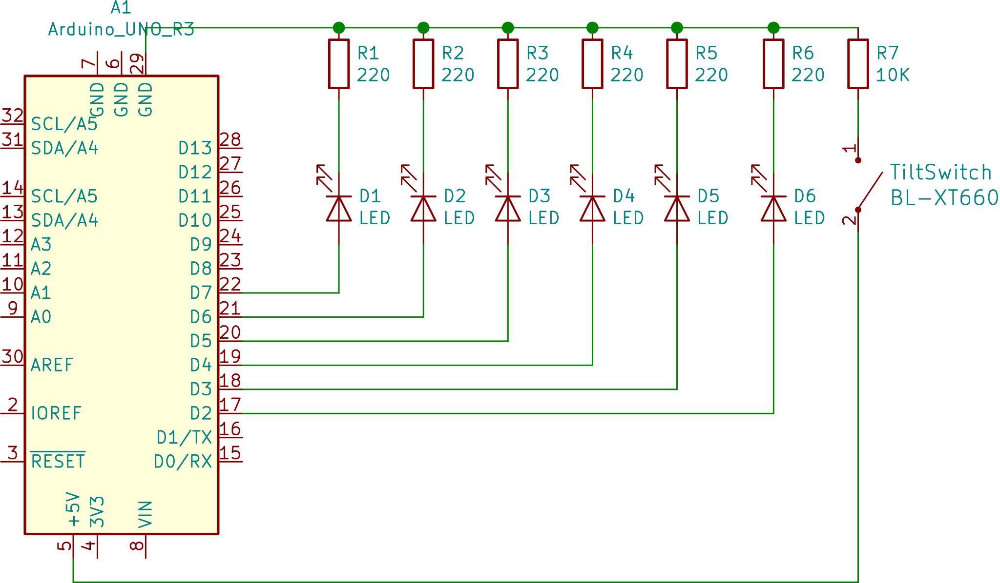

# Hourglass project
Objective is to create an hourglass using LED:s and a tilt-switch.

## Equipment
- 6 red LED:s
- 6 220Ohm resistors
- 1 10KOhm resistors
- A single ball tilt-switch
  
## Datasheets 
[Single ball tilt-switch](https://www.arduino.cc/documents/datasheets/TiltSensor.PDF)

## Circuitry

Could not find the symbol for single ball tilt-switch in kiCad so im using a switch symbol in place for tilt-switch. 

## The code
The basic idea is to use [millis()](https://www.arduino.cc/reference/en/language/functions/time/millis/) function to keep track of time interval with which we light up LED:s using [digitalWrite()](https://www.arduino.cc/reference/en/language/functions/digital-io/digitalwrite/). `millis()` return time since arduino was started in milliseconds it won't overflow for a time period of 50 days according to documentation. We read the state of tilt-switch using  [digitalRead()](https://www.arduino.cc/reference/en/language/functions/digital-io/digitalread/) and compare it state to last iteration to determine if it has been triggered if so we reset LED:s. See code in this repository for more details.