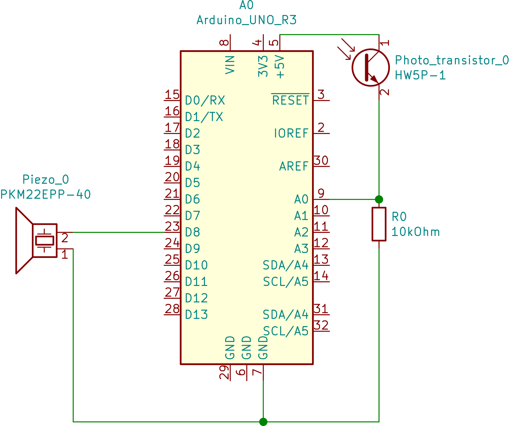

# Lighttheremin 

In this project we use a phototransistor and a piezo (speaker) to create a theremin. An electronic instrument controlled in this case by light.

## What does it do?
It emits different tone based on how much light is picked up by phototransistor.

## Equipment
Following hardware was used in addition to the arduino Uno micro controller
1. Piezo speaker
2. One 10 KOhm resistor
3. A Phototransistor

## Circuitry

