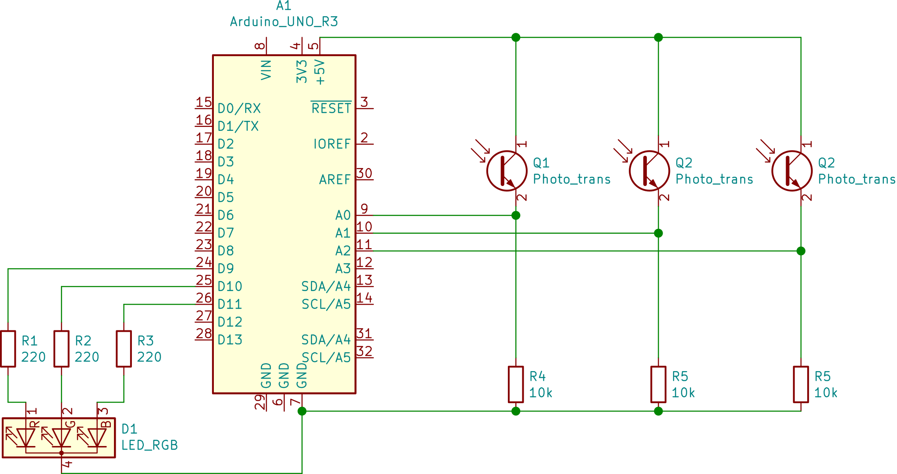

#  Color mixing lamp project

This is the color  mixing project from project book. 
The basic idée here is to connect three phototransistor to arduino analog inputs, read values and map those values in some way to digital output which is connected to an RGB LED. The RGB LED is suppose to change color depending on how much red, green, and blue light is hitting the photo-transistors.

## Equipment

- Three photo-transistors
- One tricolor LED
- Three 220 Ohm resistors
- Three 10k Ohm resistors
- GEL 

Again data sheets can be found on th arduino pages here is the [photo transistor](https://www.arduino.cc/documents/datasheets/HW5P-1.pdf) and here is the [RGB LED](https://www.arduino.cc/documents/datasheets/LED(RGB).pdf).

## Circuitry 
The circuit looks like soo

### The RGB-LED
The longest leg on the RGB-LED is the common cathode it's connected to ground. The leg on the far end which is closest to the long leg is red anode, the leg in the middle next to the longest is the blue and the last leg is the green anode. We connect 220 ohm resistors in series with each anode. As before this means we limit the current to  5/220 = 0,023A that is 23mA. According to the data-sheet 23mA is just above the forward current IF.

The RGB-LED internally just consist on three different colored LED (Red Green Blue). Our brain (through our eyes) though will perceive the color of the emitted light as a single color. The precise color perceived depends on the luminous intensity of the three different color components. Ok so one would then think that we can simply vary the  current on the different LEDS in order to vary the color. In this case it's not an option as the digital outputs always outputs 0V (LOW) or 5V (HIGH). So now what? Well there's another way of tricking the brain, another parameter we can tweak, HEUREKA TIME!

### Pulse width modulation (PWM)
We are going to make the LED:s blink with a high frequency.Doing so with high enough frequency will appear to eyes and  brain as if the thing is shining continuously. We vary the amount of time each LED is lit up (full blast) during each single blink (cycle) thus varying the luminous intensity of each built in LED. In effect each LED component will contributing  different amount color to the mix depending on length of time it's lit.  

In electronics we can achieve this effect using a technique called Pulse Width Modulation (PWM). We can think of PWM as generation of  square wave. When we talk about the **pulse width**  we simply mean the duration  of time single pulse spends in on state in our case outputting 5v. The term modulate refers to the fact that we can vary or modulate the pulse width. The percentage of time during single cycle in which pulse spends in on state we call the **duty cycle**. So if the signal spends half the time in on state the duty cycle is 50% which will render in an average voltage of 2.5 in our case. 

# TODO some explanatory images  images goes here

Arduino has a number of outputs supporting PWM (we have chosen D9, D10 and D11). On your board these outputs are prefixed with ~ sign, so for instance ~9 supports PWM. The Arduino uses a PWM frequency close to 500hz (490 Hz). This means that a new cycle will begin every 1/500= 0.002s or ever 2ms. We can control how much of those 2ms is spent in on state using the second parameter of  [analogWrite() ](https://www.arduino.cc/reference/en/language/functions/analog-io/analogwrite/) function. The second parameter should be a value between 0-255. If we want a duty cycle of 50% we could set it to 127. 

### The phototransistor
If we shine a bright light on an LED a tiny back current will flow through it (current in the opposite direction). We can amplify this current by attaching LED to the base of a transistor. This is the principle idée behind the phototransistor which allows us to measure light. The phototransistors used here measures ambient light. By covering phototransistor with red, green and blue gels we can filter and measure amount of corresponding components in ambient light. The phototransistor only has pins for collector and emitter since the light in some sense act as input signal to base and thus we don't need a pin for the base. A resistor of 10k in series with collector to ground will basically work like voltage divider (even though the phototransistor does not have fixed resistance). We connect a wire between collector and resistor to an analog input. With this setup we get an high signal whenever there is light (the more light the more current) and a low signal whenever there is no light. 

## The code
The code is pretty straight forward. The interesting part is really how to achieve mapping from input to output and how PWM is achieved.

### PWM out
 Achieving PWM is all taken care of by the function analogWrite. The second argument is a value between 0 and 255 representing the duty cycle that is the fraction of time output will spend in on state for each pulse. 0 meaning always off and 255 always on. We do as mentioned before make sure we chose output supporting PWM. Such output are prefixed with ~ on the board.

### Mapping input to output
Analog inputs goes through A/D converter which will map input to integer values between 0-1023. We simply divide input by 4 for to scale input to values between 0 and 255. Integer division behaves the same way it would in the C language 
that is remainders are truncated and division renders an integer value.