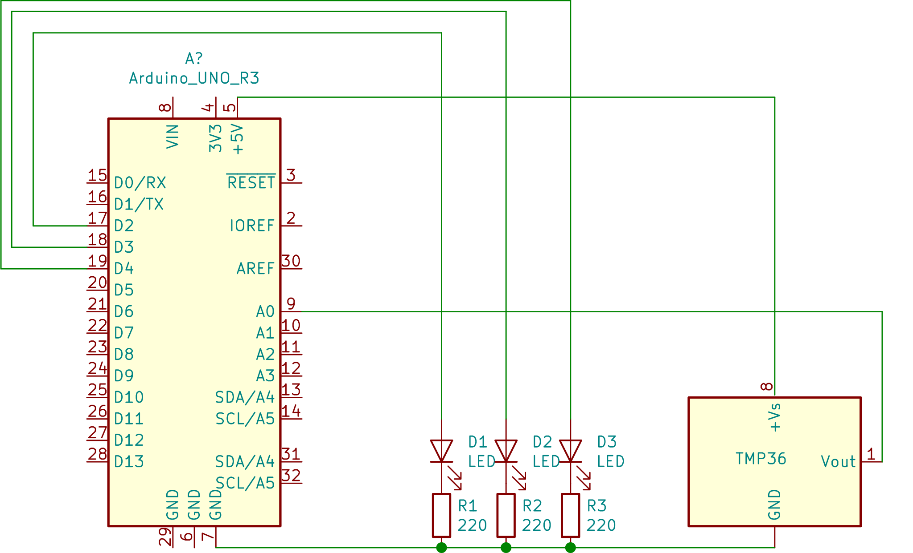

# Temperature sensor

In project we introduce reading analog data via and temperature sensor.

## What it does
The functionality is simple. The  sensor just measure temperature and the higher the temperature the more lED:s light up. 

## Equipment
Following hardware was used (Arduino Uno micro controller obviously and)

1. Three LED:s 
2. A temperature sensor (tmp36) 

## Circuitry

Below i've tried to make schema of how to connect things.

The temperature sensors data-sheet can be found [Datasheet](https://www.arduino.cc/en/uploads/Main/TemperatureSensor.pdf).

## A few words about reading analog data.
Arduino contain a D/A converter which will convert 
input to a value in the range of 0..1023 (1024 different values).
Arduino uno has operating voltage of 5V with the max resolution of 10bits we get 5 / 1024 = 0.0049V (4.9mV) per unit. If your not familiar with bits and such the 1024 comes from the fact that 10 bits can represent 210 = 1024. Some information on reading analog ports on Arduino can be found on the language documentation on [analogRead() page](https://www.arduino.cc/reference/en/language/functions/analog-io/analogread/). The serial port can be used to monitor values to and print them out to your screen. See [Serial.begin()](https://www.arduino.cc/reference/en/language/functions/communication/serial/begin/) and [Serial.print()](https://www.arduino.cc/reference/en/language/functions/communication/serial/print/) functions. Unfortunately this worked poorly inside vscode so I started up the arduino IDE on the side which seemed to interact better via serial port.

   

