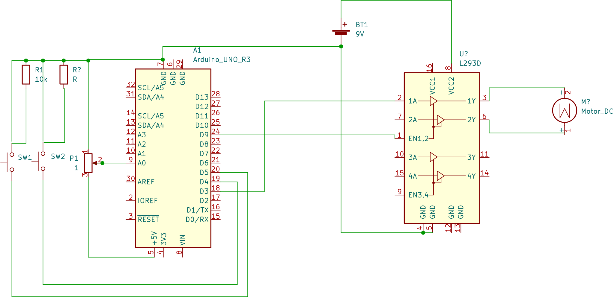

# The H-bridge

In this project we want to control spin-direction and speed DC-motor. We will control the speed using a potentiometer connected to analog PWM output.The direction togglebutton will be used to toggle the direction via arduiono which in turn will be connected to an h-bridge two switch polarity of attached motor. The motor can be toggled on and off with annother toggle button attached to arduino which in turn will signal the H-bridge to enable or disable the motor.

# Equipment

- Potentiometer
- 2 X 10 k $\Omega$ resistors
- DC motor
- H-bridge [L293D](https://www.arduino.cc/documents/datasheets/H-bridge_motor_driver.PDF)
- switch
- 9V battery

# Circuitry

.

# About the H-bridge
